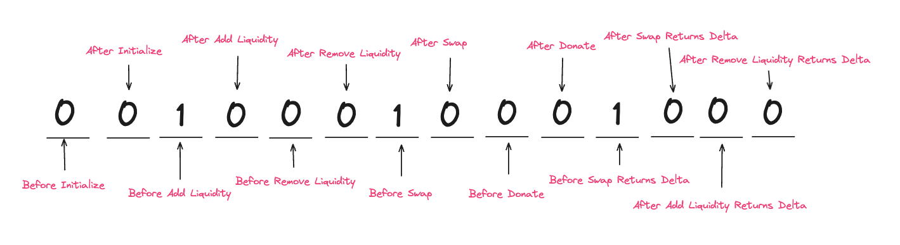

# 🦄 Uniswap v4 Indexer (Dune SIM IDX)

This project uses [Dune SIM IDX](https://docs.sim.dune.com/idx) to **index Uniswap v4 PoolManager events** directly in Solidity, 
and expose APIs for hook adoption and usage analytics.

Uniswap v4 introduces [Hooks](https://docs.uniswap.org/contracts/v4/concepts/hooks), external smart contracts that extend the behavior of liquidity pools.  
- Every **pool can have exactly one hook** chosen at initialization and stored in the pool’s unique key (`currency0, currency1, fee, tickSpacing, hooks`).  
- If `hooks = 0x000…000`, the pool is **hookless**.
- A **hook contract** can serve many pools, intercepting lifecycle actions like `beforeInitialize`, `beforeSwap`, or `afterDonate`. 
<p align="center">
  
</p>

 
**Comparison across versions**  
<table>
  <thead>
    <tr>
      <th>Version</th>
      <th>Contract</th>
      <th>Event</th>
      <th>Pool Identifier</th>
      <th><code>token0</code> / <code>token1</code> Fields</th>
      <th>Fee</th>
      <th>Hooks</th>
    </tr>
  </thead>
  <tbody>
    <tr>
      <td><b style="color:#ff007a;">v2</b></td>
      <td><a href="#">Factory</a></td>
      <td><code>PairCreated</code></td>
      <td><code>pair</code></td>
      <td><code>token0</code>, <code>token1</code></td>
      <td>N/A</td>
      <td>N/A</td>
    </tr>
    <tr>
      <td><b style="color:#ff007a;">v3</b></td>
      <td><a href="">UniswapV3Factory</a></td>
      <td><code>PoolCreated</code></td>
      <td><code>pool</code></td>
      <td><code>token0</code>, <code>token1</code></td>
      <td><code>fee</code></td>
      <td>N/A</td>
    </tr>
    <tr>
      <td><b style="color:#ff007a;">v4</b></td>
      <td><a href="#">PoolManager</a></td>
      <td><code>Initialize</code></td>
      <td><code>id</code></td>
      <td><code>currency0</code>, <code>currency1</code></td>
      <td><code>fee</code></td>
      <td><code>hooks</code></td>
    </tr>
  </tbody>
</table>


## Exposed API
`GET /hooks/0x000052423c1db6b7ff8641b85a7eefc7b2791888/adoption`

This request filters for a specific Bunni hook and returns aggregated statistics about all pools initialized with that hook on each chain (**Ethereum** and **Unichain**)
```json
{
  "data": [
    {
      "chain": "1",
      "hook": "0x000052423c1db6b7ff8641b85a7eefc7b2791888",
      "poolsCount": "40",
      "firstSeenBlock": "22690833",
      "firstSeenTs": "1749759695"
    },
    {
      "chain": "130",
      "hook": "0x000052423c1db6b7ff8641b85a7eefc7b2791888",
      "poolsCount": "50",
      "firstSeenBlock": "19141943",
      "firstSeenTs": "1749890302"
    }
  ]
}
```

## Indexing Methodology
[Dune SIM IDX](https://docs.sim.dune.com/idx) let us define **Solidity listeners** that react to Uniswap v4 PoolManger calls and events.
We use `Main.sol` to:
- Triggers on every `Initialize`, `Swap` or `ModifyLiquidity` event on Uniswap v4 across both Unichain and Ethereum.
```solidity
contract Triggers is BaseTriggers {
    function triggers() external virtual override {
        PoolManagerListener listener = new PoolManagerListener();

        // Ethereum
        addTrigger(chainContract(Chains.Ethereum, POOLMANAGER_ETHEREUM),listener.triggerOnInitializeEvent());
        addTrigger(chainContract(Chains.Ethereum, POOLMANAGER_ETHEREUM),listener.triggerOnSwapEvent());
        addTrigger(chainContract(Chains.Ethereum, POOLMANAGER_ETHEREUM),listener.triggerOnModifyLiquidityEvent());

        // Unichain
        addTrigger(chainContract(Chains.Unichain, POOLMANAGER_UNICHAIN),listener.triggerOnInitializeEvent());
        addTrigger(chainContract(Chains.Unichain, POOLMANAGER_UNICHAIN),listener.triggerOnSwapEvent());
        addTrigger(chainContract(Chains.Unichain, POOLMANAGER_UNICHAIN),listener.triggerOnModifyLiquidityEvent());

    }
}
```

We define our listener in `PoolManagerListener.sol`, which captured the following events:
- `Initialize`  → records pool creation with `{currency0, currency1, fee, tickSpacing, hooks}`.
- `Swap` → records trade amounts, price, liquidity, and tick.
- `ModifyLiquidityEvent`  → tracks liquidity added/removed by LPs.

This captured events are saved in our db in the following tables: `poolInitialized`, `poolSwap`, `LiquidityModified`

```solidity
    event PoolInitialized(
        uint64 chainId,
        bytes32 txnHash,
        uint256 blockNumber,
        uint256 blockTimestamp, 
        bytes32 id,
        address currency0,
        address currency1,
        uint24 fee,
        int24 tickSpacing,
        address hooks,
        uint160 sqrtPriceX96,
        int24 tick
  
    );

    event PoolSwap(
        uint64 chainId,
        bytes32 txnHash,
        uint256 blockNumber,
        uint256 blockTimestamp,
        bytes32 id,
        address sender,
        int128 amount0,
        int128 amount1,
        uint160 sqrtPriceX96,
        uint128 liquidity,
        int24 tick,
        uint24 fee
    );

    event LiquidityModified(
        uint64 chainId,
        bytes32 txnHash,
        uint256 blockNumber,
        uint256 blockTimestamp,
        bytes32 id,
        address sender,
        int24 tickLower,
        int24 tickUpper,
        int256 liquidityDelta,
        bytes32 salt
    );
```

## Querying Methodology
1. `/hooks/:hook/adoption`

Queries the `poolInitialized` table to aggregate pools by chain and hook address.  
It returns the number of pools created with the given hook, along with the first block and timestamp where it appeared.
```sql
SELECT chainId,
       hooks,
       count(distinct id) as poolsCount, 
       min(blockNumber) as firstSeenBlock, 
       min(blockTimestamp) as firstSeents
FROM poolInitialized
WHERE hooks = $hooks
GROUP BY 1,2
```
<!-- 2. <details> -->


## ASCII Tribute to Uniswap v4
```text
//  4
//   44
//     444
//       444                   4444
//        4444            4444     4444
//          4444          4444444    4444                           4
//            4444        44444444     4444                         4
//             44444       4444444       4444444444444444       444444
//           4   44444     44444444       444444444444444444444    4444
//            4    44444    4444444         4444444444444444444444  44444
//             4     444444  4444444         44444444444444444444444 44  4
//              44     44444   444444          444444444444444444444 4     4
//               44      44444   44444           4444444444444444444 4 44
//                44       4444     44             444444444444444     444
//                444     4444                        4444444
//               4444444444444                     44                      4
//              44444444444                        444444     444444444    44
//             444444           4444               4444     4444444444      44
//             4444           44    44              4      44444444444
//            44444          444444444                   444444444444    4444
//            44444          44444444                  4444  44444444    444444
//            44444                                  4444   444444444    44444444
//           44444                                 4444     44444444    4444444444
//          44444                                4444      444444444   444444444444
//         44444                               4444        44444444    444444444444
//       4444444                             4444          44444444         4444444
//      4444444                            44444          44444444          4444444
//     44444444                           44444444444444444444444444444        4444
//   4444444444                           44444444444444444444444444444         444
//  444444444444                         444444444444444444444444444444   444   444
//  44444444444444                                      444444444         44444
// 44444  44444444444         444                       44444444         444444
// 44444  4444444444      4444444444      444444        44444444    444444444444
//  444444444444444      4444  444444    4444444       44444444     444444444444
//  444444444444444     444    444444     444444       44444444      44444444444
//   4444444444444     4444   444444        4444                      4444444444
//    444444444444      4     44444         4444                       444444444
//     44444444444           444444         444                        44444444
//      44444444            444444         4444                         4444444
//                          44444          444                          44444
//                          44444         444      4                    4444
//                          44444        444      44                   444
//                          44444       444      4444
//                           444444  44444        444
//                             444444444           444
//                                                  44444   444
//                                                      444